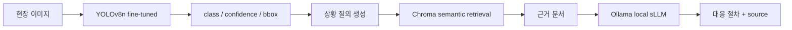
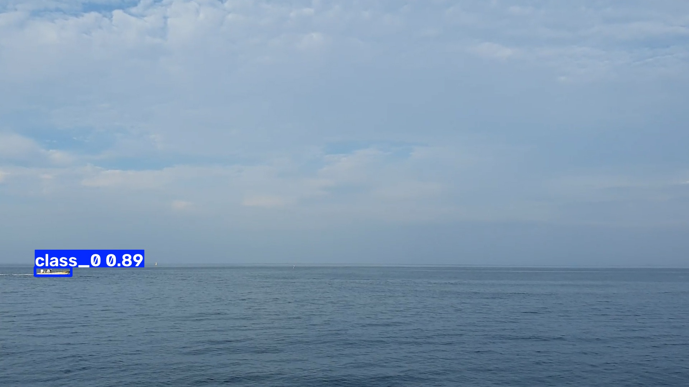
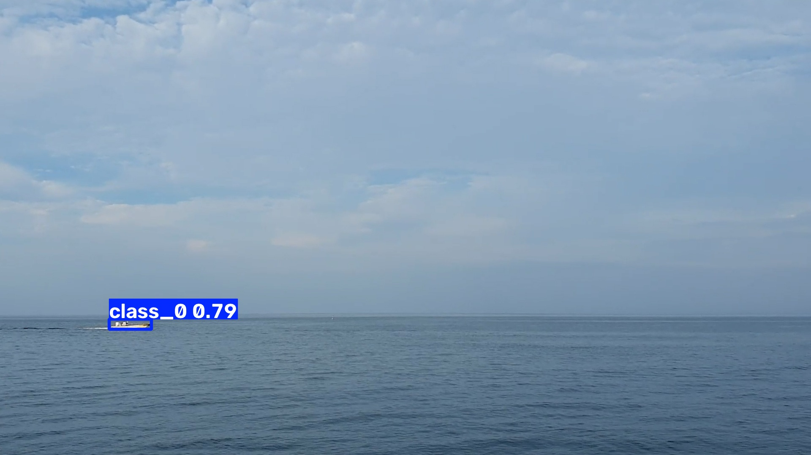

# Defense MRO Vision-RAG Pipeline

국방 경계 작전 환경의 이미지와 상황 캡션을 활용해 **fine-tuned YOLO 탐지 결과를 근거 기반 정비지원 답변으로 연결하는 On-Premise Vision-RAG 파이프라인**입니다.

## Architecture



## Verified Results

### Vision

- Base model: YOLOv8n pretrained weights
- Training: 10 epochs, `imgsz=640`, `batch=8`
- Weights: `runs/train/defense_anomaly_exp-2/weights/best.pt`
- Validation mAP50: **0.40093**
- Validation mAP50-95: **0.31663**
- Five annotated outputs are generated in [`docs/result_images/`](docs/result_images/).
- End-to-end sample: `class_0`, confidence **0.8878**, bbox `[97.3, 745.3, 198.8, 769.7]`





### RAG

- Source: JSON surveillance captions with filename and zone metadata
- Indexed chunks: **669** (666 surveillance captions + 3 prototype response-guidance records)
- Embedding: `paraphrase-multilingual-MiniLM-L12-v2`
- Vector store: persistent Chroma at `chroma_db/`
- Retrieval output includes source JSON and image metadata
- Generation: Ollama local model, default `llama3.2:3b`
- The project-owned [`response_guidance.md`](docs/response_guidance.md) is explicitly labeled as a prototype checklist, not an official maintenance manual.

Example query:

> 영상에서 `class_0 (confidence 0.89)` 상황이 탐지되었다. 현장 확인과 대응 절차를 근거 문서와 함께 제시하라.

The answer prompt requires the local model to use retrieved evidence only and include source filenames. The checked retrieval path returned three source records before generation.

## Reproduce

```powershell
.venv-1\Scripts\Activate.ps1
python -m pip install -r requirements.txt

# Build or rebuild the local Chroma index
python src\rag\ingest_caption.py

# Generate five detections with the fine-tuned model
python src\vision\infer_yolo.py

# Verify Vision -> Chroma retrieval without an LLM
python src\pipeline\end_to_end.py --no-ollama

# Install Ollama separately, then pull a local model
ollama pull llama3.2:3b

# Run Vision -> Chroma -> Ollama end to end
python src\pipeline\end_to_end.py
```

## Scope and Limitations

- This is an operational anomaly-detection and response-support prototype, not a complete PHM system. It does not yet perform sensor time-series diagnosis or RUL prediction.
- The validation set is a small sample, so the reported metrics are evidence of a working experiment rather than production performance.
- The local LLM response depends on the Ollama model installed on the execution machine; retrieved source metadata is always returned independently.

## Project Structure

```text
data/raw_sample/       # Original defense data is not committed
src/vision/             # YOLO training and fine-tuned inference
src/rag/               # Caption ingestion, Chroma retrieval, Ollama generation
src/pipeline/           # Vision -> RAG end-to-end runner
docs/result_images/    # Annotated detection examples
```
